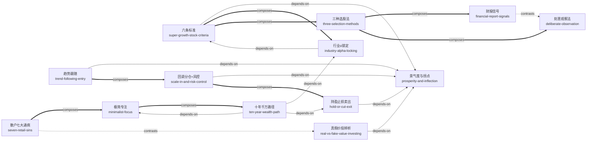

# 静水2008：极简成长股投资体系 — Skill Index

> 本书由 cangjie-skill 蒸馏，共产出 **13** 个 skills。
> 处理时间: 2026-07-07

## 关于这本书

- **作者**: 静水2008（知乎专栏）
- **发布时间**: 约 2025–2026（精确日期待校正）
- **内容类型**: 长文（成长股投资体系）
- **一句话主旨**: 找到当下最景气的超级成长股（行业 α），回调分仓介入，**对了死拿、错了砍掉**，靠两三轮产业周期实现财富跃迁。
- **整书理解**: 见 [BOOK_OVERVIEW.md](./BOOK_OVERVIEW.md)
- **精华长文** (不读全文看这篇): [DIGEST.md](./DIGEST.md)
- **术语词典**: [GLOSSARY.md](./GLOSSARY.md)

---

## Skill 列表 (按主题分组)

### 🎯 选股（找到 10 倍股）

- [`prosperity-and-inflection`](./prosperity-and-inflection/SKILL.md) — 景气度与拐点判断（体系总开关：不预测只确认）
- [`super-growth-stock-criteria`](./super-growth-stock-criteria/SKILL.md) — 超级成长股六条标准（够不够格的硬清单）
- [`industry-alpha-locking`](./industry-alpha-locking/SKILL.md) — 行业 α 锁定法（风暴之眼 + 强者恒强 + 不买杂毛）
- [`three-selection-methods`](./three-selection-methods/SKILL.md) — 三种选股方法地图（成长观察/财报/周期）

### 📈 交易（买入·持有·卖出·风控）

- [`trend-following-entry`](./trend-following-entry/SKILL.md) — 趋势跟随（创新高·只跟随不预判·两派统一）
- [`scale-in-and-risk-control`](./scale-in-and-risk-control/SKILL.md) — 回调分仓买入 + 仓位风控两条红线
- [`hold-or-cut-exit`](./hold-or-cut-exit/SKILL.md) — 持盈止损卖出框架（拐点止盈 + 看错止损）

### 🔬 投研（如何练出能力）

- [`financial-report-signals`](./financial-report-signals/SKILL.md) — 财报牛股信号 + 海量泛读以量取胜
- [`deliberate-observation`](./deliberate-observation/SKILL.md) — 刻意观察法（消费股生活信号捕捉）

### 🧭 认知与避坑（心法·误区·路径）

- [`minimalist-focus`](./minimalist-focus/SKILL.md) — 极简专注原则（全身价压筛选器 + 胜兵先胜 + 三重极简）
- [`real-vs-fake-value-investing`](./real-vs-fake-value-investing/SKILL.md) — 真假价值投资辨析 + 四大误区
- [`seven-retail-sins`](./seven-retail-sins/SKILL.md) — 散户七大通病自检清单
- [`ten-year-wealth-path`](./ten-year-wealth-path/SKILL.md) — 十年千万财富跃迁路径（入市三步）

---

## 引用图



图例:
- `-->` depends-on（A 的使用前提是先理解 B）
- `===>` composes-with（A 与 B 经常配合使用）
- `-.->` contrasts-with（A 与 B 是两种可选方案/视角）

> 注：`prosperity-and-inflection` 是被依赖最多的基础件（5 条入边），是全体系"总开关"；`minimalist-focus` 是哲学根基。

---

## 推荐学习顺序

（从依赖图的叶子 / 根基节点开始，向上）

1. **`minimalist-focus`** — 哲学根基（"敢全身价压上 / 胜兵先胜 / 大机会驱动"），先认同才走得通整套体系
2. **`prosperity-and-inflection`** — 体系总开关，被最多 skill 依赖为前置；先学会"判景气方向 / 识别拐点"
3. **`super-growth-stock-criteria`** — 用六条标准判断标的够不够格（依赖 2）
4. **`industry-alpha-locking`** — 在合格标的中锁定每轮行情的核心 α（依赖 3）
5. **`three-selection-methods`** — 发现超级成长股的三条路径总览
6. **`deliberate-observation`** — 发现法之一：从生活爆火信号找标的（与 7 互补）
7. **`financial-report-signals`** — 发现法之二：财报关键词扫描 + 海量泛读（与 6 互补）
8. **`trend-following-entry`** — 买入哲学：创新高跟随、不预判（依赖 2）
9. **`scale-in-and-risk-control`** — 买入执行 + 仓位风控两条红线（依赖 2，组合 8）
10. **`hold-or-cut-exit`** — 持盈止损卖出框架（依赖 2，组合 9，完成交易闭环）
11. **`real-vs-fake-value-investing`** — 真假价投辨析 + 四大误区（依赖 2）
12. **`seven-retail-sins`** — 散户七大通病自检（反向诊断，组合 1）
13. **`ten-year-wealth-path`** — 整合路径（依赖 1/4/10），把前面所有 skill 串成一条财富路线图

---

## 安装使用

本目录是构建产物，宿主不会从这里加载 skill。要让 agent 真正调用，把 skill 目录复制到宿主的 skills 目录：

```bash
# 用户级（所有项目可用）—— 复制全部 13 个
cp -r super-growth-stock-criteria industry-alpha-locking prosperity-and-inflection \
      three-selection-methods trend-following-entry scale-in-and-risk-control \
      hold-or-cut-exit financial-report-signals deliberate-observation \
      seven-retail-sins real-vs-fake-value-investing minimalist-focus \
      ten-year-wealth-path ~/.claude/skills/

# 或只装你最需要的几个，例如：
cp -r super-growth-stock-criteria hold-or-cut-exit ~/.claude/skills/

# 项目级
cp -r <skill-slug> <project>/.claude/skills/    # Claude Code
cp -r <skill-slug> <project>/.cursor/skills/    # Cursor
```

> ⚠️ 投资类 skill 仅作认知与方法参考，不构成任何投资建议。文中标的案例均为历史后视镜，详见各 skill 的 B 段（边界）与 BOOK_OVERVIEW 的批判段。

---

## 接入 darwin-skill

所有 skill 均带有 `test-prompts.json`（darwin-skill 兼容格式，阶段 4 产出），可直接接入自动进化：

```
darwin evolve books/jingshui-growth-stock-investing/
```

---

## 审计轨迹

- 候选单元池（170 条）: [candidates/](./candidates/)
- 三重验证通过（13 单元）: [verified.md](./verified.md)
- 被淘汰/降级/合并候选（含原因）: [rejected/rejected.md](./rejected/rejected.md)
- 整书理解（Adler 四步 + 批判）: [BOOK_OVERVIEW.md](./BOOK_OVERVIEW.md)
- 流水线状态（断点续跑）: [PIPELINE_STATE.md](./PIPELINE_STATE.md)
